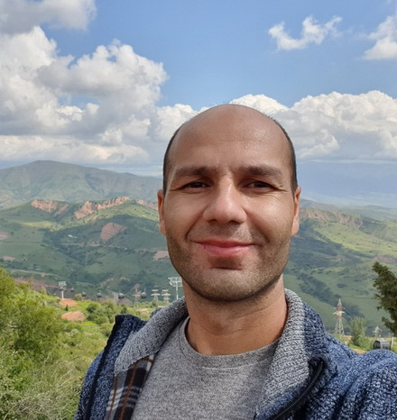

# Vagif Alikperov


## Contact information:
+ **Phone:** +998977187882
+ **E-mail:** vaga1al@mail.ru
+ **Telegram:** @HomoSapiens
+ **GitHub:** @HomoSapiens360

## About myself:

My goal is to become a frontend developer first and then 
a full stack developer. I have good logical and analytical thinking, I can set and achieve goals, I am a diligent, responsible person.

## My skills
I know how to program a little in VBA (Excel), more
I studied Android development in Java and Kotlin, but left my studies because the courses were not effective.  
* Java
* Kotlin
* HTML, CSS
* GIT
* VS Code

## Code example

**Recursion-1 > parenBit**   
Given a string that contains a single pair of parenthesis, compute recursively a new string made of only of the parenthesis and their contents, so "xyz(abc)123" yields "(abc)".   
parenBit("xyz(abc)123") → "(abc)"   
parenBit("x(hello)") → "(hello)"   
parenBit("(xy)1") → "(xy)"   
```
public String parenBit(String str) {
  if(str.isEmpty())
            return "";
        if(str.charAt(0) == '(') {
            return "(" + parenBit(str.substring(1));
        }
        if(str.charAt(0) == ')')
            return ")";
        if(str.indexOf("(") > 0)
            return parenBit(str.substring(str.indexOf("(")));
        return str.charAt(0) + parenBit(str.substring(1));
}
```
[link to the task on codingbat.com](https://codingbat.com/prob/p137918)
## Courses:

* HTML on [Code-basics.com](https://code-basics.com/ru)
* GIT on [gb.ru](https://gb.ru/)
* RS Schools Course "JavaScript/Frontend. Stage 0" (in progress)

## Languages:
* English - Intermediate (according to the online test at efset.org)   

* Russian - Native
